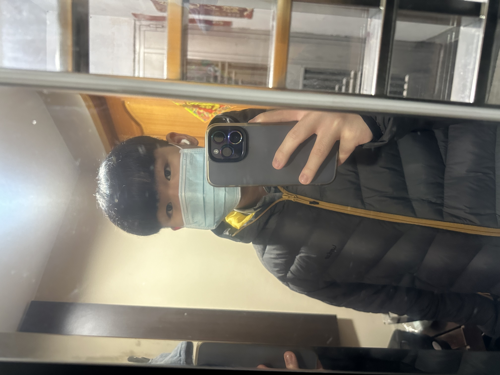

<H1> 自我簡介 </H1>

---------------------------
| 項次 | 項目 | 內容 |
|----:|------|------|
|1 | 圖片 | |
|2 | 姓名 | 陳肇延 |
|3 | 年級 | 大二 |
|4 | 就讀學校 | 龍華科大 |
|5 | 科系 | 資訊管理 |
|6 | 興趣 | 通常都在家裡玩電腦 |

<H1> 組員列表 </H1>
---------------------------

| A 組 | 姓名 | Github連結 |
|----:|------|------|
|組長 | 陳肇延 | [陳肇延 github](|
|組員 | 官威宏 | [官威宏 github](https://github.com/shiinamashironoe/d1134423036)|
|組員 | 陳則閔 | [陳則閔 github]|
|組員 | 楊博涵 | [楊博涵 github]|
